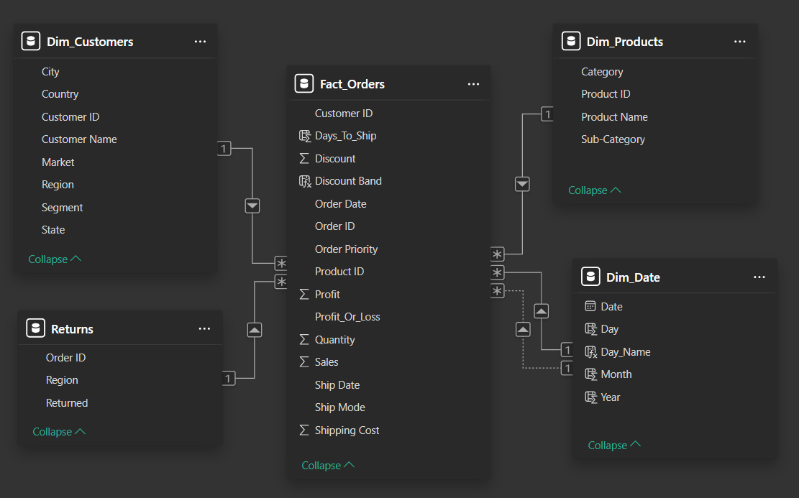

# Global Superstore

## Table of Contents
- [Introduction](#Introduction)
- [Problem Statement](#Problem-Statement)
- [Project Overview](#Project-Overview)
- [Dataset](#Dataset)
- [Data Cleaning and Preparation](#Data-Cleaning-and-Preparation)
- [Data Model](#Data-Model)
- [Report Overview](#Report-Overview)
- [Results](#Results)
- [Tools and Technologies](#Tools-and-Technologies)
- [File Structure](#File-Structure)
- [Getting Started](#Getting-Started)

## Introduction
An end-to-end analytics solution built on the Global Superstore dataset. Explore data cleaning, a star schema model, key DAX measures and interactive report pages.


## Problem Statement
The Global Superstore analytics team requires an interactive Power BI report that empowers stakeholders to:

- Monitor high-level business health through key metrics and trend analyses  
- Examine product and order level insights via tabular and matrix views, including top performers and shipping efficiency.  
- Visualize global sales distribution by country, market, and time slices with Year & Month slicers.  
- Navigate a hierarchical breakdown of sales from Market → Region → Country → City → Segment using drill-through filters.


## Project Overview

This repository delivers a complete Power BI solution, covering:

1. Data Ingestion & Cleaning  
   - Load the 2016 Global Superstore Excel dataset.  
   - Remove or correct invalid records, standardize geography, flag profit/loss.  

2. Star-Schema Data Modeling  
   - Build fact and dimension tables (Sales, Customer, Product, Date, Order).  

3. DAX Measure Development  
   - Define core KPIs: Total Sales, Profit, Loss, Profit Margin, Average Order Value, Return Rate.  

4. PostgreSQL Analytics & Metrics Materialization  
   - Create a materialized view `global_superstore_orders_metrics` summarizing total records, sales, profit breakdowns, margins, average order value, and profit per order.  
   - Use a PL/pgSQL `DO` block with `RAISE NOTICE` to print a formatted metrics report.  
   - Run queries for region- and year-level profit/sales, segment sales, discount-band analysis, top-selling product, and average ship times by region & ship mode.  

5. Interactive Power BI Report  
   - Page 1: Executive Dashboard with KPI cards, trend lines, segment share, discount impact.  
   - Page 2: Table & Matrix showing top products and average ship times by region/mode.  
   - Page 3: Geographic Map of sales volumes with Year & Month slicers.
   - Page 4: Flow Chart drill-down across Market → Region → Country → City → Segment, enriched with drill-through filters. 


## Dataset

- File: **global_superstore_2016.xlsx**  
- Source: https://powerbidocs.com/wp-content/uploads/2021/01/global_superstore_2016.xlsx  
- Primary sheet: **Orders** (51,290 rows; order, customer, product and shipment details)


## Data Cleaning and Preparation

- Removed **Postal Code** (81% missing).  
- Standardized **Country** name (“Hong Kong” → “China”).  
- Created **Profit_Or_Loss** (Profit / Loss / Neutral) for each line.
- Built `City_State_Mapping` lookup to correct city–state mismatches.  
    - Microsoft Copilot assisted in identifying incorrect city–state combinations. 


## Data Model

The analytical model is structured using a star schema, enabling efficient slicing and filtering of sales data across multiple dimensions:

| Table          | Grain                          |
| -------------- | ------------------------------ |
| **Fact_Sales**   | One row per order–product line |
| **Dim_Customers** | One row per Customer ID         |
| **Dim_Products**  | One row per Product ID          |
| **Dim_Date**     | One row per calendar date      |
| **Returns**     | One row per Order ID      |



This structure ensures fast query performance and simplifies the creation of dashboards, reports, and advanced analytics.


## Report Overview

### Page 1 – Executive Summary


The **Power BI** report opens with a high‑level performance snapshot, combining headline KPIs with regional, temporal, and segment‑based insights.  

- **Headline Metrices** – Total Sales, Total Profit, Profit Margin, Loss Margin, Net Margin, Average Order Value and Profit per Order  
- **Performance by Region** – Highlights top markets (e.g., Western Europe, Central America) while surfacing growth opportunities in smaller regions.  
- **Year‑over‑Year Trends** – Shows consistent revenue and profit growth from 2012–2015, reflecting strong upward momentum.  
- **Customer Segmentation** – Breakdowns by *Consumer*, *Corporate*, and *Home Office* reveal that the Consumer segment accounts for over 50% of sales.
- **Discount Band Impact** – Demonstrates the erosion of margins at higher discount levels, supporting strategic pricing decisions.


### Page 2 – Quarterly Insights

 

The second page of the Power BI report focuses on **temporal sales performance**, enabling a deeper understanding of trends, seasonality, and growth patterns over multiple years.  

- **Multi‑level Breakdown** – Sales are visualized by **Year → Quarter → Month**, making it easy to identify peaks, dips, and cyclical patterns.  
- **Growth & Decline Markers** – Each data point includes both the monetary change and the percentage shift versus the previous period, giving instant context for performance swings.  
- **Year‑over‑Year Patterns** – Strong growth phases (e.g., 2013’s triple‑digit quarterly gains) are contrasted with periods of slowdown or contraction, helping pinpoint where external or internal factors may have influenced results.  
- **Seasonal Signals** – Recurring high‑performing months can be leveraged for targeted campaigns, inventory planning, and promotional strategies.  
- **Performance Variability** – Certain months show notable losses despite otherwise strong quarters, highlighting potential operational or market‑driven challenges.  


### Page 3 – Regional Profit and Loss


The third page drills into **geographic performance**, spotlighting profit and loss distribution across all regions in the dataset.  

- **Top‑Performing Regions** –  
  - **Western Europe** leads with **$218K profit**, followed by strong results in **Eastern Asia**, **Southern Asia**, and **Central America** (all around $159K–$167K).  
  - Established markets like **Oceania** and **US (East & West)** also contribute significant positive margins.  
- **Moderate Profit Zones** –  
  - Regions such as **Northern & Eastern Europe**, **North Africa**, and **Central US** post steady but smaller gains, indicating stable performance without rapid growth.  
- **Loss‑Making Regions** –  
  - The biggest loss is in **Western Asia** (‑$54K), followed closely by **Western Africa** (‑$50K) and **Central Asia** (‑$7K).  
  - These markets may require deeper investigation to understand operational challenges, demand constraints, or cost structures.  


### Page 4 – Sales Breakdown


This page provides a **drill‑down view of sales** across multiple geographic and business dimensions, enabling granular exploration from global markets down to individual customer segments.  
  
- **Multi‑Level Hierarchy** – Sales are organized in a cascading structure:  
  **Market → Region → Country → City → Segment**, making it easy to zoom in from macro to micro perspectives.  
- **Market Leaders** –  
  - **Asia Pacific** emerges as the largest market, with **Oceania** contributing over $1.10M in sales.  
  - Within Oceania, **Australia** dominates at $925K+, with top‑selling cities such as **Sydney**, **Brisbane**, and **Gold Coast**.
- **City‑Level Performance** – City sales figures reveal high‑value hubs (e.g., Sydney at $111K+) and mid‑tier performers, supporting localized strategy and marketing.  
- **Segment Contribution** – Segment splits (*Consumer*, *Corporate*, *Home Office*) are shown for each city, highlighting differences in buying patterns across locations.  
- **Regional Comparisons** – Other high‑value markets include **Europe** ($3.28M), **USCA** ($2.36M), and **LATAM** ($2.16M), with Africa and parts of Asia contributing smaller but still notable volumes.  


### Page 5 – Global Sales Overview


This page presents a **geospatial view of sales distribution**, enabling a quick visual grasp of market performance across the globe.  

- **Market Segmentation by Geography** –  
  Countries are grouped into major markets (Africa, Asia Pacific, Europe, LATAM, USCA), with clear color‑coding for instant regional identification.  
- **Sales Volume Indicators** –  
  The size of each marker on the map correlates with total sales, making it easy to spot high‑revenue countries at a glance.  
- **High‑Performing Regions** –  
  Larger clusters and markers in areas such as **North America**, **Western Europe**, and **Asia Pacific** indicate significant market contributions.  
- **Emerging & Niche Markets** –  
  Smaller markers in parts of Africa, South America, and Central Asia suggest untapped or developing potential, offering opportunities for growth strategies.  


### Page 6 – Performance Summary


The final page consolidates **product‑level performance** with **operational efficiency metrics**, providing both revenue insights and service quality indicators in a single view.  


- **Top‑Selling Products** –  
  - Highlights the **Top 20 products by total sales**, led by the *Apple Smart Phone, Full Size* ($86.9K) and other high‑volume items.  
  - The full list accounts for over **$1.02M in sales**, offering a clear view of the product mix driving the largest share of revenue.  

- **Operational Metrics – Average Ship Time** –  
  - Tracks average delivery times across four shipping classes (*First Class*, *Same Day*, *Second Class*, *Standard Class*) for each region.  
  - Notable variations in ship times by region suggest opportunities to streamline logistics in slower markets without compromising cost efficiency. 


## Results

- **Year-over-Year Growth:**  
  Total sales increased from **$2,677,438.69** in **2013** to **$3,405,746.45** in **2014**, marking the **highest year-over-year growth** in the **2012–2015** period at **27.20%**.  

- **Regional Performance:**  
  - **Western Europe** recorded the **highest sales** at **$1,731,929.67** and the **highest total profit** at **$314,970.32**, with a **net profit and loss** figure of **$218,433.51**, leading all regions.  
  - By market, **Asia Pacific** achieved the **highest total sales** at **$4,042,658.27**, followed by **Europe** with **$3,287,336.23**.  

- **Customer Segments:**  
  The **Consumer** segment dominated sales with **$6,507,949.42** (**51.48%**), followed by **Corporate** (**30.25%**) and **Home Office** (**18.27%**).  

- **Quarterly Sales Trends:**  
  Sales **consistently peaked** in the **final month** of each quarter across most years.  

- **Discount Band Insights:**  
  - The **0–5% discount band** generated the **highest sales** (**$7,253,806.57**) and the **highest profit and loss figure** (**$1,828,671.85**).  
  - The **20–85% discount band** resulted in a **net loss** of **$814,682.09**.  


## Tools and Technologies
- Power BI Desktop
- Microsoft Excel 2021
- PostgreSQL
- Microsoft Copilot


## File Structure

```
├── data/
│   ├── csv/
│   │   └── cleaned_global_superstore_2016.csv
│   ├── cleaned_global_superstore_2016.xlsx
│   └── global_superstore_2016.xlsx
├── images/
│   ├── data_model/
│   │   └── model_view.png
│   ├── issues/
│   │   └── issues_log.png
│   ├── report/
│   │   ├── executive_summary.png
│   │   ├── quarterly_insights.png
│   │   ├── regional_profit_and_loss.png
│   │   ├── sales_breakdown.png
│   │   ├── global_sales_overview.png
│   │   └── performance_summary.png
│   └── report_pages.png
├── report/
│   └── global_superstore_report.pbix
├── sql/
│   └── global_superstore_analysis.sql
│   └── table.sql
└── README.md
```


## Getting Started

1. Clone or download this repository.
2. Place global_superstore_2016.xlsx in the project root.
3. Open global_superstore_report.pbix in Power BI Desktop (v2.78+).
4. In Power BI Desktop, go to Transform data → Data source settings, and point the Excel data source to data/cleaned_global_superstore_2016.xlsx.
5. In the Navigator window, select the Cleaned_Orders and Returns sheets, then click Load.
6. Click Refresh to load and apply all preconfigured Power Query transforms.
7. Explore the report.