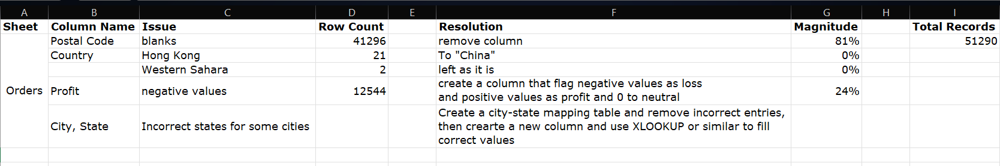

# Global Superstore

An end-to-end analytics solution built on the Global Superstore dataset. Explore data cleaning, a star schema model, key DAX measures and interactive report pages.


---

## Problem Statement
The Global Superstore analytics team requires an interactive Power BI report that empowers stakeholders to:

- Monitor high-level business health through key metrics and trend analyses  
- Examine product and order level insights via tabular and matrix views, including top performers and shipping efficiency.  
- Visualize global sales distribution by country, market, and time slices with Year & Month slicers.  
- Navigate a hierarchical breakdown of sales from Market → Region → Country → City → Segment using drill-through filters.

## Project Overview

This repository delivers a complete Power BI solution, covering:

1. Data Ingestion & Cleaning  
   - Load the 2016 Global Superstore Excel dataset.  
   - Remove or correct invalid records, standardize geography, flag profit/loss.  

2. Star-Schema Data Modeling  
   - Build fact and dimension tables (Sales, Customer, Product, Date, Order).  

3. DAX Measure Development  
   - Define core KPIs: Total Sales, Profit, Loss, Profit Margin, Average Order Value, Return Rate.  

4. PostgreSQL Analytics & Metrics Materialization  
   - Create a materialized view `global_superstore_orders_metrics` summarizing total records, sales, profit breakdowns, margins, average order value, and profit per order.  
   - Use a PL/pgSQL `DO` block with `RAISE NOTICE` to print a formatted metrics report.  
   - Run queries for region- and year-level profit/sales, segment sales, discount-band analysis, top-selling product, and average ship times by region & ship mode.  

5. Interactive Power BI Report  
   - Page 1: Executive Dashboard with KPI cards, trend lines, segment share, discount impact.  
   - Page 2: Table & Matrix showing top products and average ship times by region/mode.  
   - Page 3: Geographic Map of sales volumes with Year & Month slicers.
   - Page 4: Flow Chart drill-down across Market → Region → Country → City → Segment, enriched with drill-through filters. 

---

## Dataset

- File: **global_superstore_2016.xlsx**  
- Source: https://powerbidocs.com/wp-content/uploads/2021/01/global_superstore_2016.xlsx  
- Primary sheet: **Orders** (51,290 rows; order, customer, product and shipment details)

---

## Data Cleaning & Issue Log

- Removed **Postal Code** (81% missing).  
- Standardized **Country** name (“Hong Kong” → “China”).  
- Created **Profit_Or_Loss** (Profit / Loss / Neutral) for each line.
- Built `City_State_Mapping` lookup to correct city–state mismatches.  
    - Microsoft Copilot assisted in identifying incorrect city–state combinations. 



---

## Data Model

| Table          | Grain                          |
| -------------- | ------------------------------ |
| **Fact_Sales**   | One row per order–product line |
| **Dim_Customer** | One row per CustomerID         |
| **Dim_Product**  | One row per ProductID          |
| **Dim_Date**     | One row per calendar date      |


---

## Report Pages

### Page 1 – Executive Dashboard

- KPI cards: Total Sales, Total Profit, Profit Margin, Loss Margin, Net Margin, Average Order Value and Profit per Order  
- Sales & Profit by Region
- Year-over-year trend (2012–2015)  
- Segment share breakdown (Consumer, Corporate, Home Office)  
- Discount band impact on Sales vs. Profit  


### Page 2 – Table & Matrix

- Top 20 Selling Products 
- Average ship time (days) matrix by Region × Ship Mode  


### Page 3 – Geographic Map

- World map with circle markers sized by Sales  
- Year and Month slicers (2012–2016, January–December)  
- Market color legend (Africa, Asia Pacific, Europe, LATAM, USCA)  


### Page 4 – Flow Chart

- Total Sales: $12,642,501.91  
- Drill-down from Market → Region → Country → City → Segment  
- Year and Month slicers (Year (2012–2016), Month (January-December))


---

## File Structure

```
├── data/
│   ├── csv/
│   │   └── cleaned_global_superstore_2016.csv
│   ├── cleaned_global_superstore_2016.xlsx
│   └── global_superstore_2016.xlsx
├── images/
│   ├── data_model/
│   │   └── Model_View.png
│   ├── issues/
│   │   └── issues_log.png
│   ├── report/
│   │   ├── Dashboard.png
│   │   ├── Table_and_Matrix.png
│   │   ├── Map.png
│   │   └── Flow_Chart.png
│   └── report_pages.png
├── report/
│   └── global_superstore_report.pbix
├── sql/
│   └── global_superstore_analysis.sql
│   └── table.sql
└── README.md
```

---

## Getting Started

1. Clone or download this repository.
2. Place global_superstore_2016.xlsx in the project root.
3. Open global_superstore_report.pbix in Power BI Desktop (v2.78+).
4. In Power BI Desktop, go to Transform data → Data source settings, and point the Excel data source to data/cleaned_global_superstore_2016.xlsx.
5. In the Navigator window, select the Cleaned_Orders and Returns sheets, then click Load.
6. Click Refresh to load and apply all preconfigured Power Query transforms.
7. Explore the report:
    - Navigate dashboard pages
    - Use slicers to filter by region, category, time period, etc.
    - Drill through on any chart to see transaction-level details

---